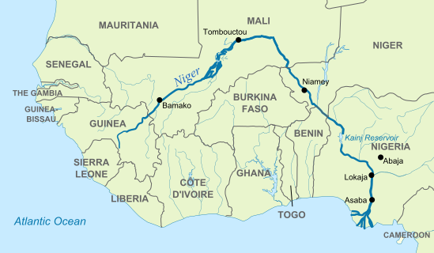
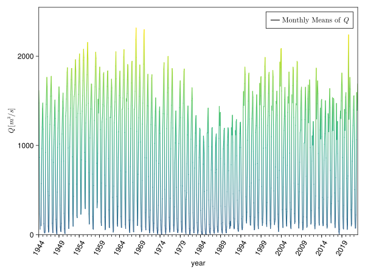
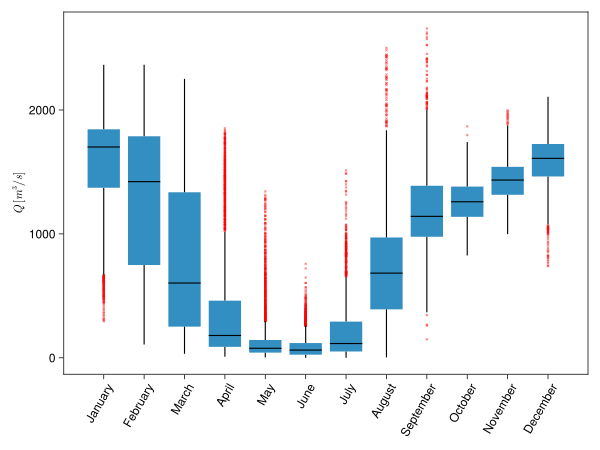
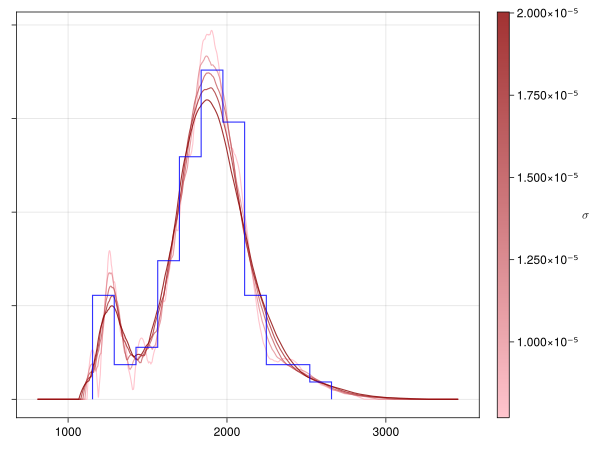
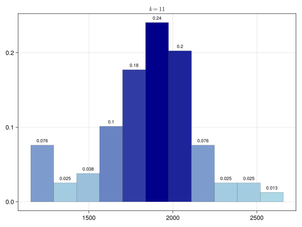
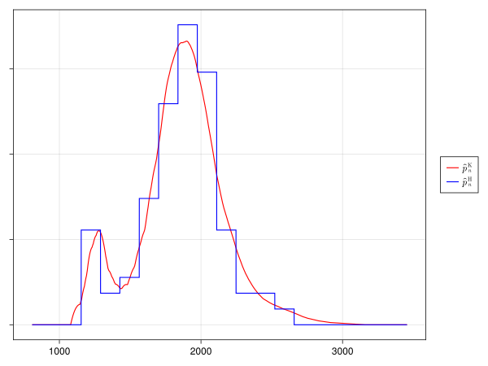
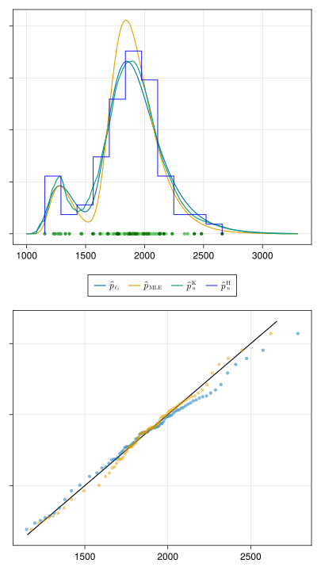

# Niger River Flood Hazard Analysis

This repository contains a statistical analysis of historical discharge data from the Niger River at the Niamey station.
The project estimates probabilities related to flood hazards and drought levels for the year 2023 using
distribution-free, non-parametric, and parametric methods.

The compiled documents can be found in the [releases](https://github.com/kunzaatko/NigerRiverFloodAnalysis/releases).
The latest built PDF of the report is available
[here](https://github.com/kunzaatko/NigerRiverFloodAnalysis/releases/latest/download/01MEU_Niger_River.pdf).

## Key Figures

- **Map of the Niger River**: Overview of the river's path and drainage basin.
  

- **Full Overview of Discharge Data**: Timeseries showing annual maxima and minima from 1944 to 2022.
  

- **Seasonality Analysis**: Boxplot of monthly discharge data showing seasonal patterns.
  

- **Kernel Density Bandwidth Comparison**: Comparison of different bandwidths for kernel density estimation.
  

- **Histogram of Discharge Data**: Histogram with 11 bins showing the distribution of annual maximum discharges.
  

- **Kernel Density Estimate**: Non-parametric density estimation of annual maximum discharges.
  

- **Parametric Fit**: Mixture of Gumbel distributions fitted to the data.
  
